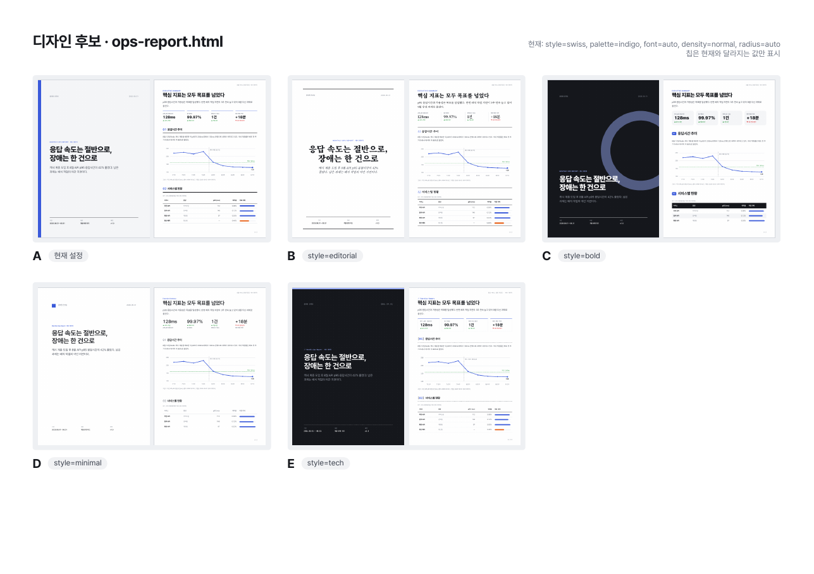
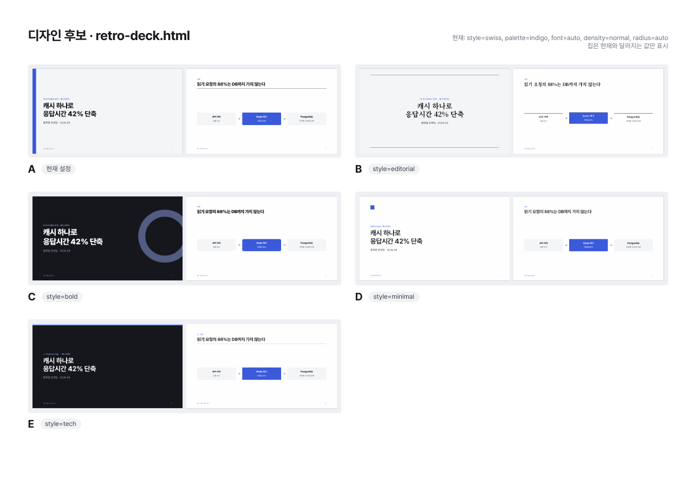

# pdf-kit

Claude Code와 Codex에서 함께 쓰는 **디자인 선택형 PDF 제작 스킬**입니다.
HTML/CSS 템플릿에 내용을 채우고 Chrome으로 PDF를 렌더링합니다. 디자인은 여러 축으로 나뉘어 있어서, 한 축만 바꿔도 나머지 설정과 내용은 그대로 유지됩니다. 예를 들어 "스타일만 바꾸고 색조는 유지"가 가능합니다.



## 디자인 축

| 축 | 옵션 | 값 |
|---|---|---|
| 스타일 | `--style` | `swiss` · `editorial` · `bold` · `minimal` · `tech` |
| 색조 | `--palette` | `indigo` · `navy` · `terracotta` · `forest` · `plum` · `mono` |
| 폰트 | `--font` | `auto` · `sans` · `serif` · `mono` |
| 밀도 | `--density` | `normal` · `compact` · `airy` |
| 모서리 | `--radius` | `auto` · `sharp` · `soft` · `round` |
| 포인트색 | `--accent` | `#RRGGBB` · `none` |

템플릿은 `report`(표지·쪽번호가 있는 A4 보고서), `onepager`(A4 한 장), `deck`(16:9 발표 자료) 세 가지입니다.

<details><summary>발표 자료 스타일 비교, 색조 비교</summary>




</details>

## 설치

```bash
git clone https://github.com/kgyujin/pdf-kit.git ~/workspace/pdf-kit
~/workspace/pdf-kit/install.sh
```

`~/.claude/skills/pdf-kit`와 `~/.codex/skills/pdf-kit`에 심볼릭 링크가 만들어집니다. Codex 경로는 `CODEX_HOME`이 설정돼 있으면 그 값을 따릅니다. 저장소를 `git pull`하면 두 도구에 바로 반영되고, `./install.sh --uninstall`로 링크를 제거할 수 있습니다.

필요한 프로그램:
- Google Chrome, Chromium, Edge 중 하나(필수). 다른 위치에 있으면 `CHROME_PATH`로 지정합니다.
- Poppler(`pdftoppm`, `pdfinfo`): 미리보기와 갤러리에 필요합니다. macOS는 `brew install poppler`로 설치합니다.
- Python 3.9 이상(표준 라이브러리만 사용)

## 에이전트에게 이렇게 요청하세요

- "이 내용으로 보고서 PDF 만들어줘. 디자인 시안 몇 개 보여줘"
- "B안으로 하고, 색은 지금 그대로 둬"
- "스타일은 editorial로 바꾸고 포인트색만 #e8590c로"
- "촘촘하게 해서 2쪽 안에 들어가게 해줘"
- "앞으로 이 폴더 문서는 이 디자인으로 만들어줘" → `pdf-kit.json`에 저장

## CLI 직접 사용

```bash
K=~/workspace/pdf-kit/scripts/pdfkit.py

python3 $K options                                             # 선택지 보기
python3 $K init report out/report.html --style bold --palette navy
python3 $K gallery out/report.html --styles all                # 색조 유지, 스타일 5안 비교
python3 $K gallery out/report.html --palettes all              # 스타일 유지, 색조 6안 비교
python3 $K set out/report.html --style editorial               # 스타일만 변경
python3 $K set out/report.html --accent "#e8590c" --save       # 포인트색 변경 + 기본값 저장
python3 $K render out/report.html --preview                    # PDF + 페이지 PNG
```

`gallery`는 `<문서명>_gallery/gallery.pdf`와 `sheet/page-N.png`(비교표)를 만들고, 후보별 적용 명령을 출력합니다.

## 구조

```
SKILL.md                 에이전트용 작업 절차
scripts/pdfkit.py        CLI (options · init · set · render · gallery)
assets/css/
  core.css               공통 구조·컴포넌트 (토큰만 사용)
  palettes.css           색조
  styles/*.css           스타일
  options.css            폰트·밀도·모서리
templates/               report · onepager · deck
references/              디자인 규칙, 스타일 가이드, 컴포넌트, 확장 방법
examples/                예시 문서 (수치는 모두 예시 데이터)
tests/                   unittest
```

`init`·`set`·`render`는 CSS를 합친 `pdf-kit.css`를 문서 옆에 생성합니다. 이 파일은 생성물이므로 직접 수정하지 말고, 문서별 수정은 문서의 `<style>`에 적습니다.

## 개발

```bash
python3 -m compileall -q scripts tests
python3 -m unittest discover -s tests
```

스타일이나 색조를 추가하는 방법은 [references/extending.md](references/extending.md)를 참고하세요.
