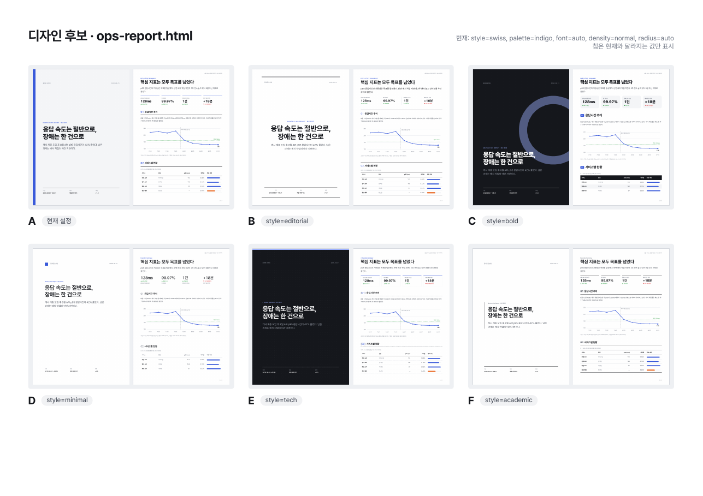
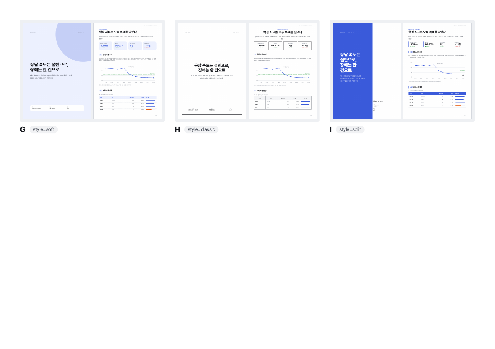
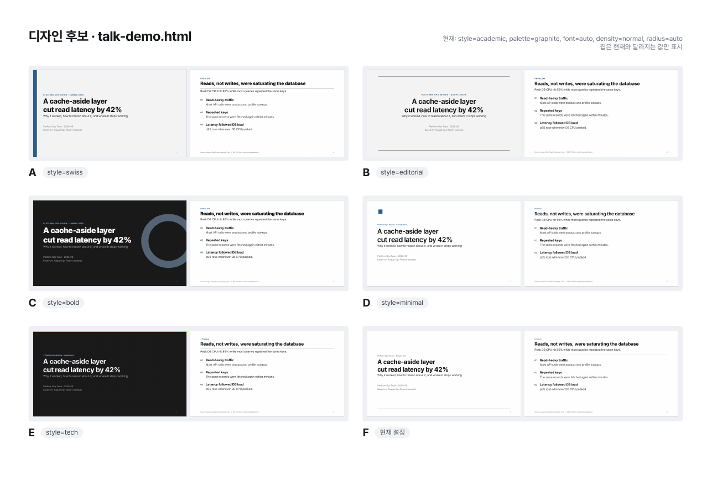
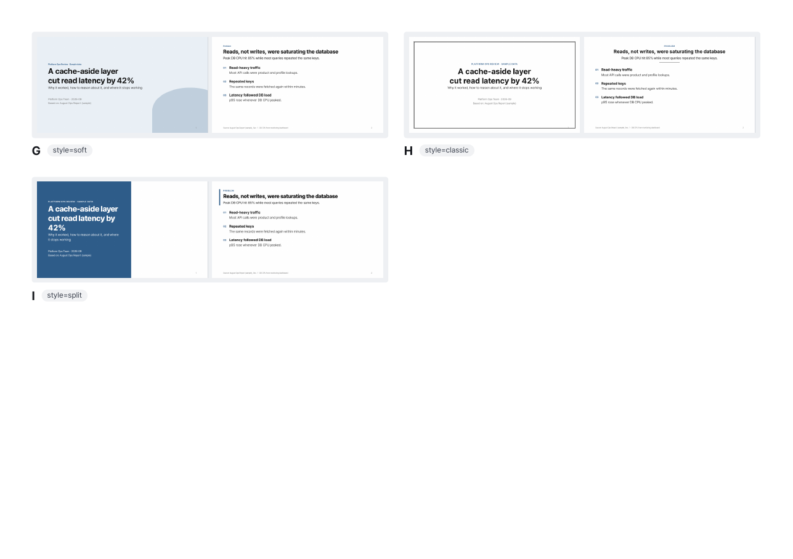
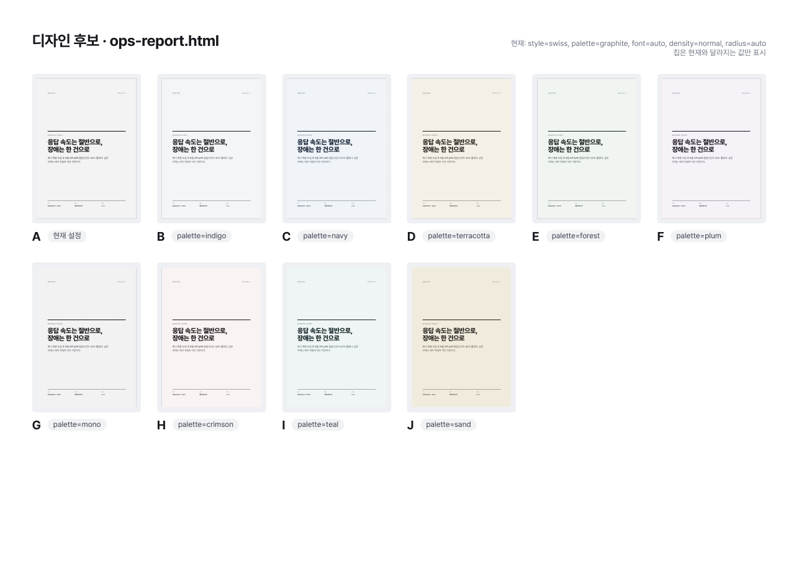
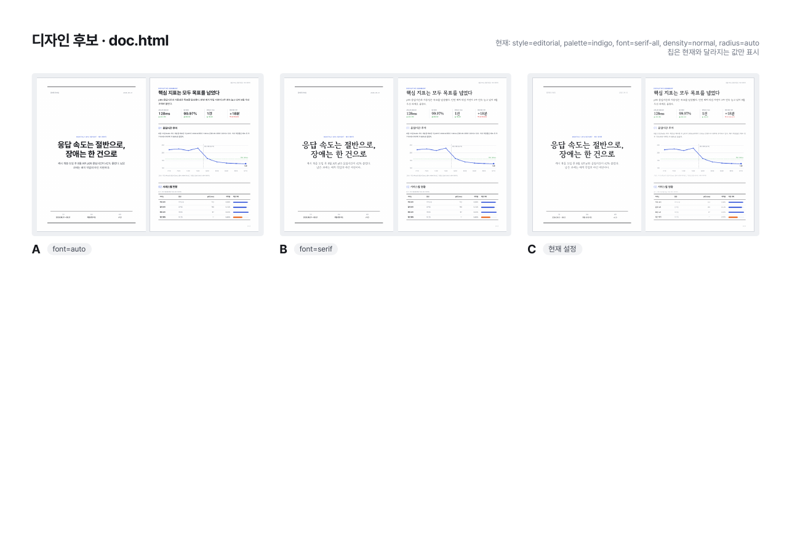
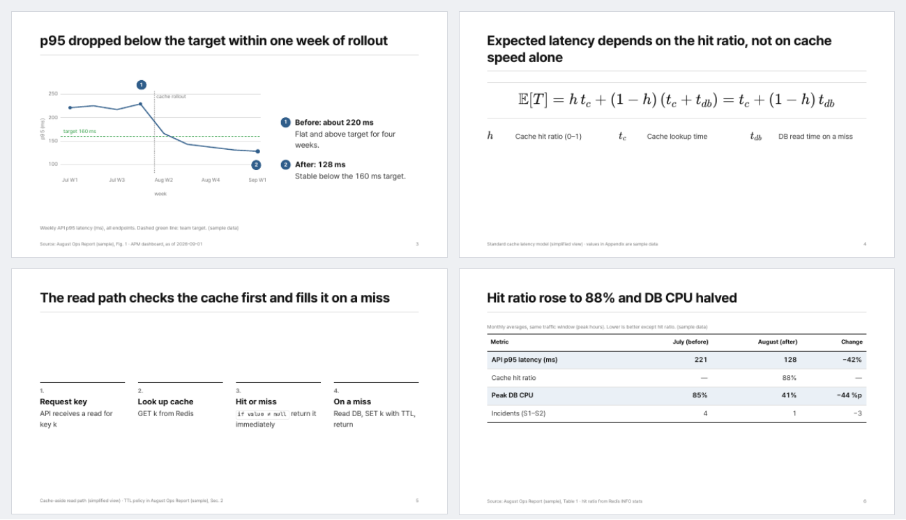

# pdf-design

Claude Code와 Codex에서 함께 쓰는 **디자인 선택형 PDF 제작 스킬**입니다.
HTML/CSS 템플릿에 내용을 채우고 Chrome으로 PDF를 렌더링합니다. 디자인은 여러 축으로 나뉘어 있어서, 한 축만 바꿔도 나머지 설정과 내용은 그대로 유지됩니다. 예를 들어 "스타일만 바꾸고 색조는 유지"가 가능합니다.

논문이나 보고서를 **발표용 슬라이드 PDF와 슬라이드별 발표 대본 DOCX**로 만드는 발표 자료 모드와, 넘침·작은 글씨·노트 누락을 잡는 자동 검수(`check`)도 들어 있습니다.



## 디자인 축

| 축 | 옵션 | 값 |
|---|---|---|
| 스타일 | `--style` | `swiss` · `editorial` · `bold` · `minimal` · `tech` · `academic` · `soft` · `classic` · `split` |
| 색조 | `--palette` | `indigo` · `navy` · `terracotta` · `forest` · `plum` · `mono` · `graphite` · `crimson` · `teal` · `sand` |
| 폰트 | `--font` | `auto` · `sans` · `serif` · `serif-all` · `mono` |
| 밀도 | `--density` | `normal` · `compact` · `airy` |
| 모서리 | `--radius` | `auto` · `sharp` · `soft` · `round` |
| 포인트색 | `--accent` | `#RRGGBB` · `none` |

기본 폰트는 모든 스타일에서 고딕(Pretendard)입니다. 바탕체·명조체는 요청할 때만 쓰며(`serif`: 제목만, `serif-all`: 본문까지), 폰트는 [고운바탕](https://fonts.google.com/specimen/Gowun+Batang)입니다.

| 템플릿 | 용도 |
|---|---|
| `report` | 표지·러닝 헤더·쪽번호가 있는 A4 보고서 |
| `onepager` | A4 한 장(이력서, 프로젝트 요약) |
| `deck` | 짧은 16:9 발표 |
| `talk` | 논문·보고서 기반 발표. 레이아웃 8종, KaTeX 수식, 발표자 노트 → DOCX 대본 |

<details><summary>스타일·색조 비교 더 보기</summary>







</details>

## 발표 자료 모드



- **레이아웃 8종**: 핵심 포인트, Figure + 번호 설명, 수식 + 기호 설명, 절차·Algorithm, 비교, 표, 좌우 분할, 섹션 구분
- **발표자 노트**: 슬라이드마다 `aside.notes`에 작성합니다. `script` 명령이 이를 슬라이드 썸네일과 함께 DOCX 대본으로 만들고, 대본 분량으로 발표 시간을 추정합니다.
- **출처·해석 구분**: 모든 슬라이드 하단에 출처가 들어가고, 제작자 해석은 점선 박스(`.interp`)로 원본 주장과 구분합니다.
- **자동 검수(`check`)**: 페이지 밖으로 넘친 요소, 출처·쪽번호와의 겹침, 10pt 미만 글자, 16pt 미만 본문, 작은 수식·Figure 글자, 깨지거나 흐린 이미지, 수식 오류, 노트·출처 누락을 찾습니다.

프롬프트 템플릿: [prompts/presentation.md](prompts/presentation.md). 원본 자료와 발표 조건을 채워 에이전트에게 붙여 넣으면 `talk.pdf`, `talk_script.docx`, 수정할 수 있는 `talk.html`이 만들어집니다. 예제는 [examples/talk-demo.html](examples/talk-demo.html)에 있습니다(수치는 모두 예시 데이터).

## 설치

```bash
git clone https://github.com/kgyujin/pdf-design.git ~/workspace/pdf-design
~/workspace/pdf-design/install.sh
```

`~/.claude/skills/pdf-design`과 `~/.codex/skills/pdf-design`에 심볼릭 링크가 만들어집니다. Codex 경로는 `CODEX_HOME`이 설정돼 있으면 그 값을 따릅니다. 저장소를 `git pull`하면 두 도구에 바로 반영되고, `./install.sh --uninstall`로 링크를 제거할 수 있습니다.

필요한 프로그램:
- Google Chrome, Chromium, Edge 중 하나(필수). 다른 위치에 있으면 `CHROME_PATH`로 지정합니다.
- Poppler(`pdftoppm`, `pdfinfo`): 미리보기, 갤러리, 대본 썸네일에 필요합니다. macOS는 `brew install poppler`로 설치합니다.
- Python 3.9 이상(표준 라이브러리만 사용, DOCX 생성 포함)
- 인터넷 연결: 웹폰트와 KaTeX를 CDN에서 받습니다. 오프라인이면 폰트는 OS 한글 폰트로 대체되고, 수식은 렌더링되지 않습니다(`check`가 알려줍니다).

## 에이전트에게 이렇게 요청하세요

- "이 내용으로 보고서 PDF 만들어줘. 디자인 시안 몇 개 보여줘"
- "B안으로 하고, 색은 지금 그대로 둬"
- "스타일은 editorial로 바꾸고 포인트색만 #e8590c로"
- "촘촘하게 해서 2쪽 안에 들어가게 해줘"
- "이 논문으로 20분 발표 슬라이드와 대본 만들어줘" (+ `prompts/presentation.md`의 조건)
- "앞으로 이 폴더 문서는 이 디자인으로 만들어줘" → `pdf-design.json`에 저장

## CLI 직접 사용

```bash
K=~/workspace/pdf-design/scripts/pdfdesign.py

python3 $K options                                             # 선택지 보기
python3 $K init report out/report.html --style bold --palette navy
python3 $K gallery out/report.html --styles all                # 색조 유지, 스타일 9안 비교
python3 $K gallery out/report.html --palettes all --pages 1    # 스타일 유지, 색조 10안 비교
python3 $K set out/report.html --style editorial               # 스타일만 변경
python3 $K set out/report.html --accent "#e8590c" --save       # 포인트색 변경 + 기본값 저장
python3 $K render out/report.html --preview                    # PDF + 페이지 PNG

python3 $K init talk out/talk.html                             # 발표 자료 (academic + graphite)
python3 $K render out/talk.html --preview --expect-pages 9
python3 $K check out/talk.html                                 # 자동 검수 (오류가 있으면 종료 코드 1)
python3 $K script out/talk.html --minutes 20                   # talk_script.docx + 발표 시간 추정
```

`gallery`는 `<문서명>_gallery/gallery.pdf`와 `sheet/page-N.png`(비교표)를 만들고, 후보별 적용 명령을 출력합니다.

## 구조

```
SKILL.md                 에이전트용 작업 절차
prompts/presentation.md  발표 자료 제작 프롬프트 템플릿
scripts/
  pdfdesign.py           CLI (options · init · set · render · gallery · check · script)
  deck_tools.py          슬라이드·노트 파싱, 발표 시간 추정, 레이아웃 검사 스크립트
  docx_writer.py         표준 라이브러리 DOCX 생성기
assets/css/
  core.css               공통 구조·컴포넌트·슬라이드 레이아웃 (토큰만 사용)
  palettes.css           색조
  styles/*.css           스타일
  options.css            폰트·밀도·모서리
templates/               report · onepager · deck · talk
references/              디자인 규칙, 스타일 가이드, 컴포넌트, 발표 자료 절차, 확장 방법
examples/                예시 문서 (수치는 모두 예시 데이터)
tests/                   unittest
```

`init`·`set`·`render`는 CSS를 합친 `pdf-design.css`를 문서 옆에 생성합니다. 이 파일은 생성물이므로 직접 수정하지 말고, 문서별 수정은 문서의 `<style>`에 적습니다.

## 개발

```bash
python3 -m compileall -q scripts tests
python3 -m unittest discover -s tests
```

Chrome과 Poppler가 없으면 렌더링 테스트는 건너뜁니다. 스타일이나 색조를 추가하는 방법은 [references/extending.md](references/extending.md)를 참고하세요.
